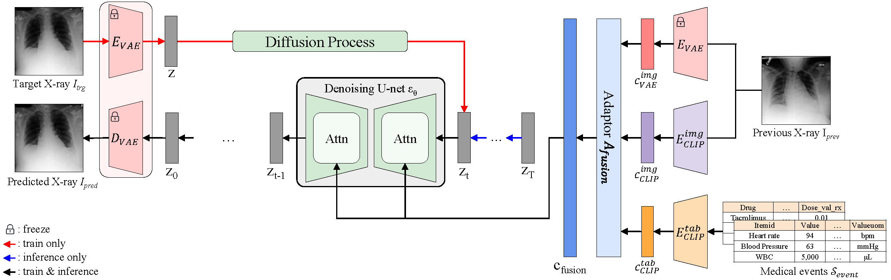

# Towards Predicting Temporal Changes in a Patient's Chest X-ray Images based on Electronic Health Records 
<b> <a href="https://arxiv.org/abs/2409.07012">Towards Predicting Temporal Changes in a Patient's Chest X-ray Images based on Electronic Health Records</a> </b> 
<br>
<a href="https://dek924.github.io/"> Daeun Kyung</a>,
<a href="https://starmpcc.github.io/"> Junu Kim</a>,
<a href="https://scholar.google.co.kr/citations?user=9juBDkAAAAAJ&hl=ko"> Tackeun Kim</a>,
<a href="https://mp2893.com/"> Edward Choi</a>
<br>
<a href="https://chil.ahli.cc/"> CHIL 2025 (Poster) </a>

## Overview
Chest X-ray (CXR) is an important diagnostic tool widely used in hospitals to assess patient conditions and monitor changes over time. Recently, generative models, specifically diffusion-based models, have shown promise in generating realistic synthetic CXRs. However, these models mainly focus on conditional generation using single-time-point data, i.e., generating CXRs conditioned on their corresponding reports from a specific time. This limits their clinical utility, particularly for capturing temporal changes. To address this limitation, we propose a novel framework, EHRXDiff, which predicts future CXR images by integrating previous CXRs with subsequent medical events, e.g., prescriptions, lab measures, etc. Our framework dynamically tracks and predicts disease progression based on a latent diffusion model, conditioned on the previous CXR image and a history of medical events. We comprehensively evaluate the performance of our framework across three key aspects, including clinical consistency, demographic consistency, and visual realism. Results show that our framework generates high-quality, realistic future images that effectively capture potential temporal changes. This suggests that our framework could be further developed to support clinical decision-making and provide valuable insights for patient monitoring and treatment planning in the medical field.

 

<br />

## Updates
- [08/27/2025] Our model is now available on [Hugging Face](https://huggingface.co/dek924/ehrxdiff).
- [06/26/2025] We presented our paper as a poster at CHIL 2025.
- [05/06/2025] We updated our paper on [arXiv](https://arxiv.org/abs/2409.07012).
- [09/11/2024] We released our research paper on [arXiv](https://arxiv.org/abs/2409.07012).

<br />

## Environment

### Setup
Clone the repository and navigate into the directory:
```
$ git clone https://github.com/dek924/EHRXDiff.git
$ cd EHRXDiff
```

### Installation
For Linux, ensure that you have python 3.10 or higher installed on your machine.
Set up the environment and install the required packages using the commands below:
```
# Set up the environment
conda create -n ehrxdiff python=3.10

# Activate the environment
conda activate ehrxdiff

# Install required packages
pip install "pip<24.1"
pip install torch==1.11.0+cu113 torchvision==0.12.0+cu113 torchaudio==0.11.0 --extra-index-url https://download.pytorch.org/whl/cu113
pip install -r requirements.txt
```
<br />

## Download

### Dataset
We are currently utilizing three databases: MIMIC-IV (v2.2), MIMIC-CXR-JPG (v2.0.0), and Chest ImaGenome (v1.0.0). All these source datasets require a credentialed Physionet credentialing. To access the source datasets, you must fulfill all of the following requirements:
1. Be a [credentialed user](https://physionet.org/settings/credentialing/)
    - If you do not have a PhysioNet account, register for one [here](https://physionet.org/register/).
    - Follow these [instructions](https://physionet.org/credential-application/) for credentialing on PhysioNet.
    - Complete the "CITI Data or Specimens Only Research" [training course](https://physionet.org/about/citi-course/).
2. Sign the data use agreement (DUA) for each project
    - https://physionet.org/sign-dua/mimic-cxr-jpg/2.0.0/
    - https://physionet.org/sign-dua/chest-imagenome/1.0.0/
    - https://physionet.org/sign-dua/mimiciv/2.2/

After obtaining access, follow the steps in [prepare_datasets.md](./data_preprocessing/prepare_datasets.md) to preprocess the dataset.

### Pretrained Model
#### Model Checkpoint
To train our model, you need the pretrained checkpoints, 1) Chest X-ray autoencoder, 2) CXR-EHR CLIP pre-trained model weight. You can download these weights in below link:
1) Chest X-ray autoencoder (from <a href="https://github.com/saiboxx/chexray-diffusion">Cheff original implementation</a>) [<a href="https://syncandshare.lrz.de/getlink/fiQ6wTe7K7otQzyifNh9av/cheff_autoencoder.pt">link</a>]
2) CXR-EHR CLIP pre-trained model weight (from <a href="https://huggingface.co/dek924/ehrxdiff">Hugging Face</a>)
    - Use the following code to download the model:
        ```python
        from huggingface_hub import hf_hub_download

        hf_hub_download("dek924/ehrxdiff_wnull", "checkpoints/clip_vit32_256_1024.ckpt")
        ```
    - After downloading, move these checkpoints to the `EHRXDiff/trained_models`.
    - You can also pre-train your own model by following the instructions in [CLIP_pretrain.md](./CLIP_pretrain/CLIP_pretrain.md)

#### EHRXDiff Checkpoint
The pre-trained weights for our models, **EHRXDiff** and **EHRXDiff<sub>w\_null</sub>**, are available on Hugging Face:

* **EHRXDiff**: [https://huggingface.co/dek924/ehrxdiff](https://huggingface.co/dek924/ehrxdiff)
* **EHRXDiff<sub>w\_null</sub>**: [https://huggingface.co/dek924/ehrxdiff\_wnull](https://huggingface.co/dek924/ehrxdiff_wnull)

<br />


## Train
To train EHRXDiff, run `scripts/01_train_ldm.py` with the hyper-parameters provided below:
```
cd EHRXDiff
python scripts/01_train_ldm.py -b configs/<config_name>.yml -t --no-test --name <exp_name>
```
**Note**: The configuration for training the EHRXDiff model without data augmentation is `configs/EHRXDiff.yaml`, while the configuration for training the EHRXDiff<sub>w_null</sub> model, with augmentation is `configs/EHRXDiff_wnull.yaml`. <br /><br />


## Inference
To run the inference, use the following command:
```
python scripts/eval.py \
    --sdm_path=${EXP_ROOT}/checkpoints/${CHECKPOINT_PATH} # Path to the model checkpoint file
    --save_dir=${EXP_ROOT}/images/seed${RAND_SEED}
    --img_meta_dir=${IMG_META_DIR} # Directory containing metadata for MIMIC-CXR-JPG \
    --img_root_dir=${IMG_ROOT_DIR} # Directory containing preprocessed images \
    --tab_root_dir=${TAB_ROOT_DIR} # Directory containing tabular data \
    --seed=${RAND_SEED} \
    --batch_size=${BATCHSIZE} \
```
**Note**: The hyperparameters used in our paper's experiments are set as default.
<br /><br />


## Evaluation
We evaluate the prediction of our proposed framework using multiple classifier models.
The detail of each metric is provided in [evaluation.md](./evaluation/evaluation.md).
<br /><br />


## Acknowledgements
This implementation uses code from following repositories:
- [Official Cheff implementation](https://github.com/saiboxx/chexray-diffusion)
- [Official Latent Diffusion Models implementation](https://github.com/CompVis/latent-diffusion)

We thank the authors for their open-sourced code.


## Citation
```
@inproceedings{kyung2025ehrxdiff, 
  title={Towards Predicting Temporal Changes in a Patient's Chest X-ray Images based on Electronic Health Records},
  author={Kyung, Daeun and Kim, Junu and Kim, Tackeun and Choi, Edward},
  booktitle={Proc. of Conference on Health, Inference, and Learning (CHIL)},
  year={2025}
}
```

## Contact
For any questions or concerns regarding this code, please contact to us ([kyungdaeun@kaist.ac.kr](mailto:kyungdaeun@kaist.ac.kr)).
